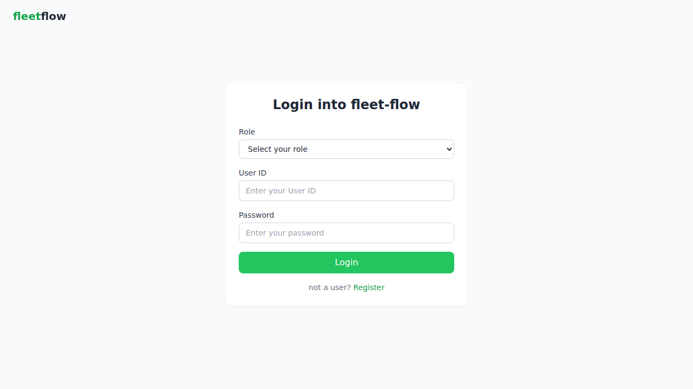
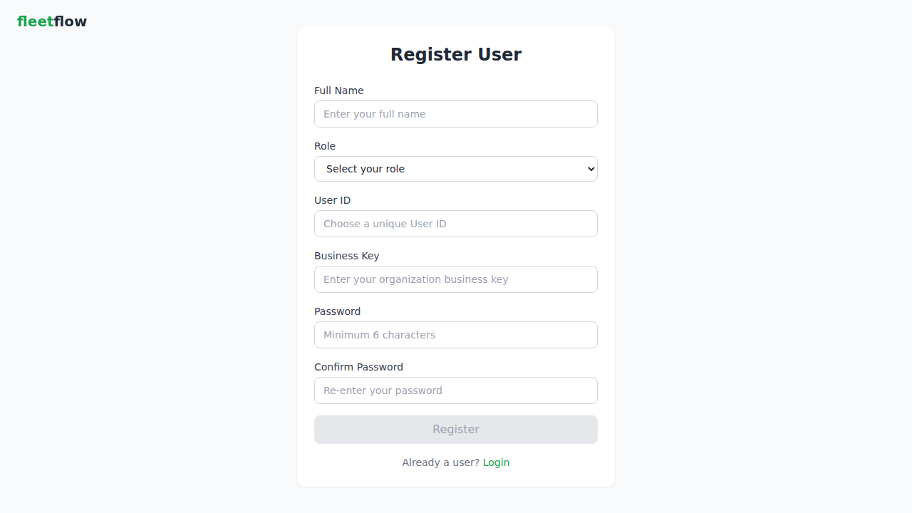
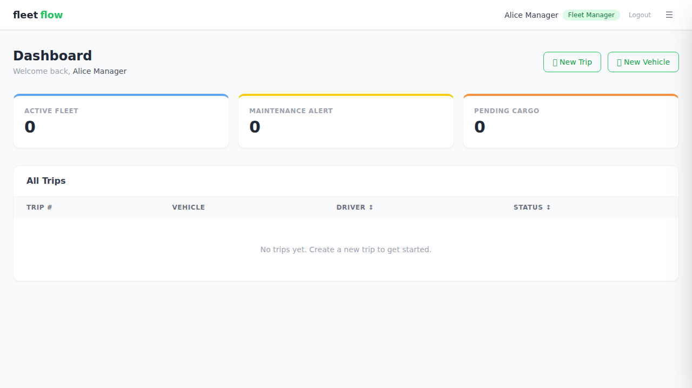
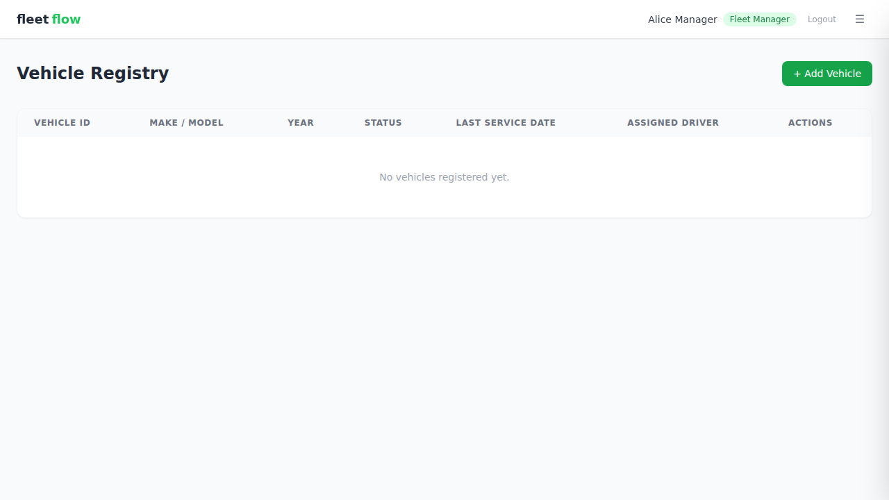
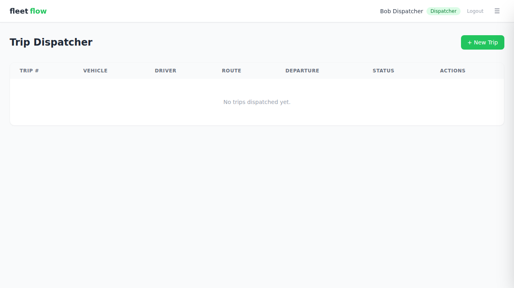
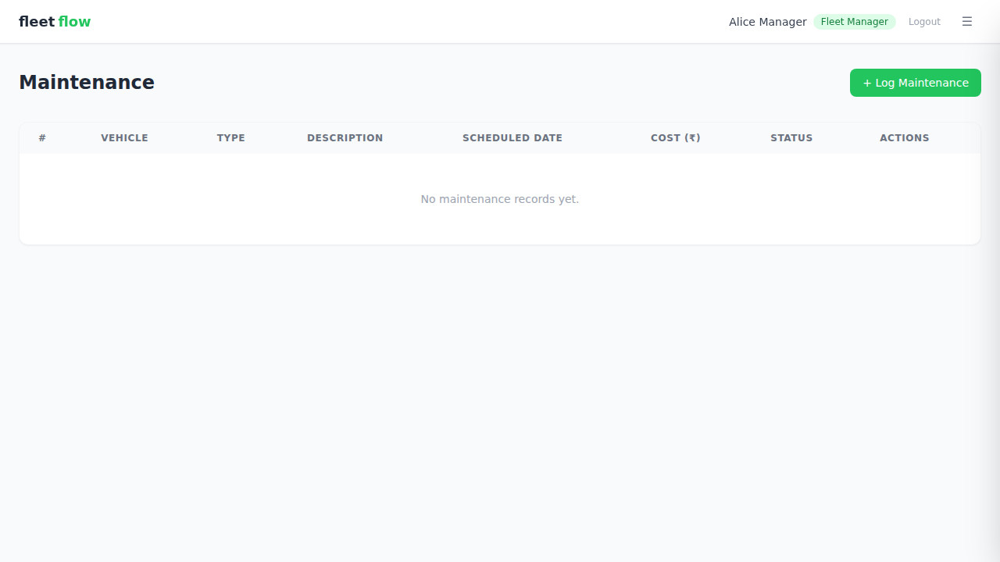
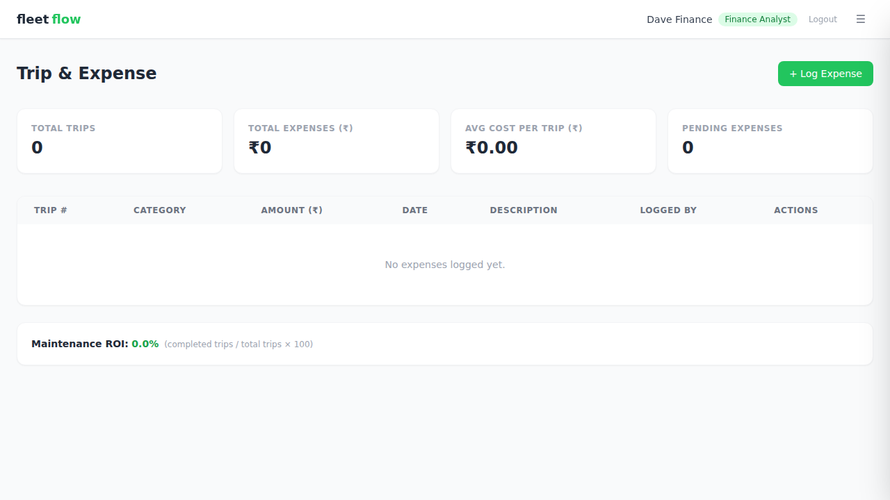
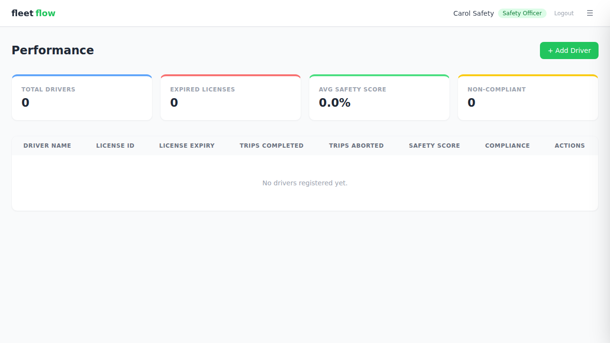
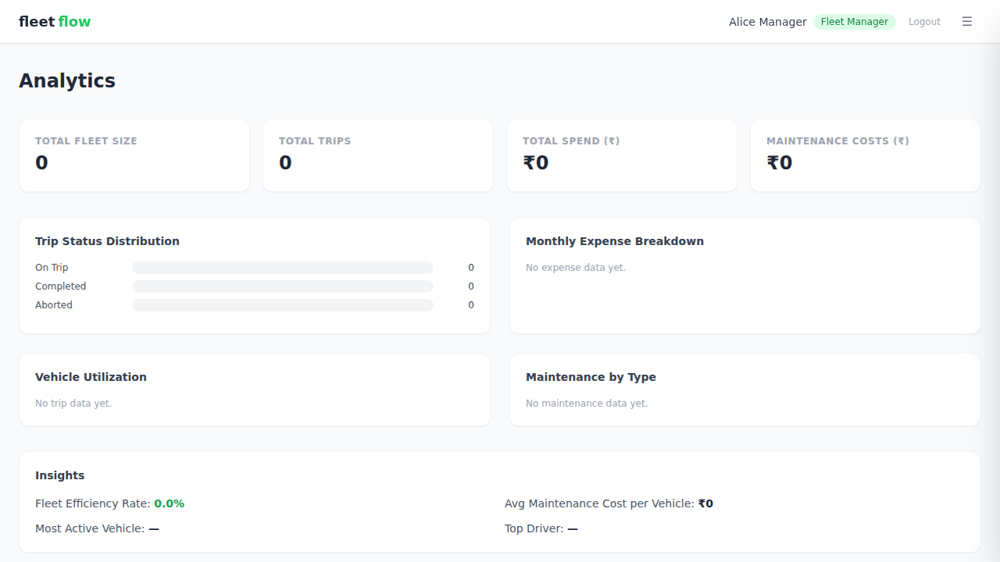
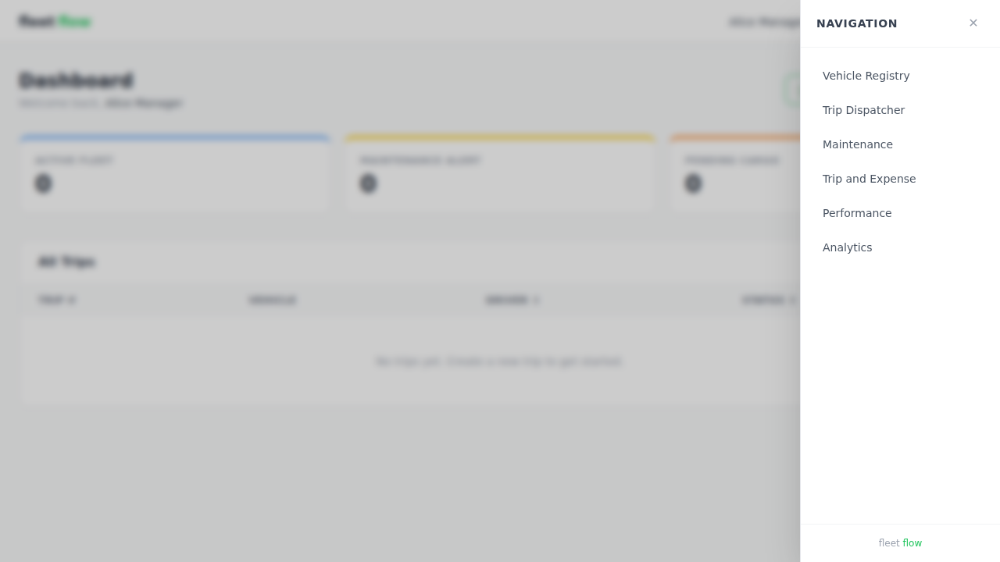

# 🌱 FleetFlow — Sample Data Reference

This document explains the demo dataset that is seeded into Firestore by `backend/seed.js`, how to run the seed, and how to log in as each demo user.

---

## 📋 Table of Contents

- [How to Seed the Database](#-how-to-seed-the-database)
- [Login Credentials](#-login-credentials)
- [Sample Data Reference](#-sample-data-reference)
  - [Users](#users)
  - [Vehicles](#vehicles)
  - [Trips](#trips)
  - [Maintenance Records](#maintenance-records)
  - [Expenses](#expenses)
  - [Drivers](#drivers)
- [Quick-Start Walkthrough](#-quick-start-walkthrough)
- [Where to Find Each Value](#-where-to-find-each-value)
- [📸 Screenshots](#-screenshots)

---

## 🚀 How to Seed the Database

**Prerequisites:** Backend dependencies must be installed and Firebase credentials must be configured (see [README.md](README.md#4-firebase-configuration)).

```bash
cd backend
npm run seed
```

The script will:
1. Clear any existing `BK-DEMO-999` data from all collections (idempotent — safe to re-run)
2. Insert 4 users, 5 vehicles, 6 trips, 4 maintenance records, 8 expenses, and 4 drivers
3. Print a confirmation summary with the demo login credentials

> **Note:** The seed script uses the same `bcrypt` hashing as the app's registration endpoint, so demo users can log in immediately after seeding.

---

## 🔑 Login Credentials

All demo accounts use business key **`BK-DEMO-999`** and password **`demo1234`**.

| User ID | Password | Role | Accessible Pages |
|---------|----------|------|-----------------|
| `alice-mgr` | `demo1234` | Fleet Manager | Dashboard, Vehicle Registry, Maintenance, Analytics |
| `bob-dispatch` | `demo1234` | Dispatcher | Dashboard, Trip Dispatcher |
| `carol-safety` | `demo1234` | Safety Officer | Dashboard, Maintenance, Performance |
| `dave-finance` | `demo1234` | Finance Analyst | Dashboard, Trip & Expense, Analytics |

---

## 📊 Sample Data Reference

### Users

| Username | User ID | Role | Business Key | Extra Fields |
|----------|---------|------|-------------|-------------|
| Alice Manager | `alice-mgr` | Fleet Manager | BK-DEMO-999 | — |
| Bob Dispatcher | `bob-dispatch` | Dispatcher | BK-DEMO-999 | licenseId: `DL-2024-BOB-7890`, licenseExpiry: `2026-08-15` |
| Carol Safety | `carol-safety` | Safety Officer | BK-DEMO-999 | — |
| Dave Finance | `dave-finance` | Finance Analyst | BK-DEMO-999 | — |

### Vehicles

| Vehicle ID | Make | Model | Year | Status | Last Service | Assigned Driver | Notes |
|------------|------|-------|------|--------|-------------|----------------|-------|
| VH-001 | Tata | Prima 4928 | 2022 | Active | 2025-12-10 | Ravi Kumar | Long-haul truck, GPS equipped |
| VH-002 | Ashok Leyland | 4220 | 2021 | Active | 2025-11-20 | Suresh Patel | Refrigerated cargo unit |
| VH-003 | Mahindra | Blazo X 46 | 2023 | In Maintenance | 2026-01-05 | — | Engine overhaul in progress |
| VH-004 | BharatBenz | 1617R | 2020 | Active | 2025-10-15 | Amit Singh | City delivery vehicle |
| VH-005 | Eicher | Pro 6049 | 2019 | Retired | 2025-06-30 | — | Decommissioned - high mileage |

### Trips

| Trip # | Vehicle | Driver | Origin | Destination | Departure | Cargo | Weight (kg) | Est. Arrival | Status |
|--------|---------|--------|--------|-------------|-----------|-------|-------------|-------------|--------|
| 1 | VH-001 | Ravi Kumar | Mumbai | Delhi | 2026-02-15 06:00 | Electronics | 18,000 | 2026-02-17 14:00 | on trip |
| 2 | VH-002 | Suresh Patel | Chennai | Bangalore | 2026-02-10 08:00 | Frozen Foods | 12,000 | 2026-02-10 18:00 | completed |
| 3 | VH-004 | Amit Singh | Pune | Hyderabad | 2026-02-12 07:00 | Auto Parts | 8,500 | 2026-02-13 10:00 | completed |
| 4 | VH-001 | Ravi Kumar | Delhi | Jaipur | 2026-01-20 05:30 | Textiles | 15,000 | 2026-01-20 14:00 | completed |
| 5 | VH-002 | Suresh Patel | Bangalore | Kochi | 2026-02-18 09:00 | Pharmaceuticals | 5,000 | 2026-02-19 08:00 | on trip |
| 6 | VH-004 | Amit Singh | Hyderabad | Mumbai | 2026-02-05 06:00 | Construction Material | 20,000 | 2026-02-07 12:00 | aborted |

### Maintenance Records

| Vehicle | Type | Description | Scheduled Date | Est. Cost (₹) | Actual Cost (₹) | Technician | Status | Resolved Date |
|---------|------|-------------|---------------|--------------|----------------|-----------|--------|--------------|
| VH-003 | Emergency | Engine overhaul - abnormal vibration | 2026-01-05 | 75,000 | 82,000 | Mohan Garage Works | In Progress | — |
| VH-001 | Scheduled | Regular service - oil change and brake check | 2026-03-01 | 12,000 | — | FleetCare Service Center | Scheduled | — |
| VH-005 | Routine | Final inspection before decommission | 2025-06-25 | 5,000 | 4,800 | QuickFix Auto | Resolved | 2025-06-28 |
| VH-002 | Scheduled | Refrigeration unit maintenance | 2026-02-28 | 25,000 | — | CoolTech Services | Overdue | — |

### Expenses

| Receipt | Trip # | Category | Amount (₹) | Date | Description |
|---------|--------|----------|-----------|------|-------------|
| REC-001 | 1 | Fuel | 15,000 | 2026-02-15 | Diesel fill-up Mumbai depot |
| REC-002 | 1 | Toll | 3,200 | 2026-02-15 | Mumbai-Delhi expressway tolls |
| REC-003 | 2 | Fuel | 8,000 | 2026-02-10 | Diesel - Chennai depot |
| REC-004 | 2 | Driver Pay | 5,000 | 2026-02-10 | Suresh Patel trip payment |
| REC-005 | 3 | Fuel | 6,500 | 2026-02-12 | Diesel fill-up Pune |
| REC-006 | 3 | Loading/Unloading | 2,000 | 2026-02-12 | Loading charges Pune warehouse |
| REC-007 | 4 | Fuel | 9,000 | 2026-01-20 | Diesel - Delhi depot |
| REC-008 | 6 | Miscellaneous | 4,500 | 2026-02-05 | Tow truck charges after breakdown |

**Total seeded expenses: ₹53,200**

### Drivers

| Name | License ID | License Expiry | Phone | Notes |
|------|-----------|---------------|-------|-------|
| Ravi Kumar | DL-2024-RAV-1234 | 2027-03-15 | 9876543210 | Senior driver, 8 years experience |
| Suresh Patel | DL-2023-SUR-5678 | 2025-12-01 | 9876543211 | Specialized in refrigerated transport |
| Amit Singh | DL-2025-AMI-9012 | 2028-06-20 | 9876543212 | City routes specialist |
| Priya Sharma | DL-2024-PRI-3456 | 2026-01-10 | 9876543213 | New hire, under probation |

---

## 🧭 Quick-Start Walkthrough

### As Alice Manager — Fleet Manager

1. Open **http://localhost:5173**
2. Select role **Fleet Manager**, enter User ID `alice-mgr`, password `demo1234`
3. **Dashboard** — view trip summary cards (2 on trip, 3 completed, 1 aborted) and a live trip table
4. Navigate to **Vehicle Registry** — see 5 vehicles (3 Active, 1 In Maintenance, 1 Retired); try adding or editing a vehicle
5. Navigate to **Maintenance** — see 4 records with statuses (In Progress, Scheduled, Resolved, Overdue)
6. Navigate to **Analytics** — view KPI cards (total trips, active vehicles, total expenses) and the monthly bar chart

---

### As Bob Dispatcher — Dispatcher

1. Select role **Dispatcher**, enter User ID `bob-dispatch`, password `demo1234`
2. **Dashboard** — overview of active trips
3. Navigate to **Trip Dispatcher** — see all 6 trips; filter by status; create a new trip or update an existing one's status

---

### As Carol Safety — Safety Officer

1. Select role **Safety Officer**, enter User ID `carol-safety`, password `demo1234`
2. **Dashboard** — maintenance alerts summary
3. Navigate to **Maintenance** — view and update maintenance records
4. Navigate to **Performance** — see 4 drivers with safety scores, license compliance, and trip history

---

### As Dave Finance — Finance Analyst

1. Select role **Finance Analyst**, enter User ID `dave-finance`, password `demo1234`
2. **Dashboard** — expense KPI overview
3. Navigate to **Trip & Expense** — see 8 expenses across trips; add or edit expenses; view total by category
4. Navigate to **Analytics** — expense breakdown charts and fleet-wide KPIs

---

## 🔍 Where to Find Each Value

| Value | Location |
|-------|---------|
| **Business keys** | `backend/business-keys.json` — `["BK-FLEET-001", "BK-FLEET-002", "BK-FLEET-003", "BK-DEMO-999"]` |
| **User accounts** | Firestore `users` collection, or register via the app UI at `/register` |
| **Roles** | Defined in `src/pages/LoginPage.jsx` and `src/App.jsx` |
| **Vehicles** | Firestore `vehicles` collection, or managed via the Vehicle Registry page |
| **Trips** | Firestore `trips` collection, or managed via the Trip Dispatcher page |
| **Trip statuses** | `"on trip"`, `"completed"`, `"aborted"` |
| **Maintenance types** | `"Scheduled"`, `"Emergency"`, `"Routine"` |
| **Maintenance statuses** | `"Scheduled"`, `"In Progress"`, `"Resolved"`, `"Overdue"` |
| **Expense categories** | `"Fuel"`, `"Maintenance"`, `"Driver Pay"`, `"Toll"`, `"Loading/Unloading"`, `"Miscellaneous"` |
| **Drivers** | Firestore `drivers` collection, or managed via the Performance page |
| **Seed script** | `backend/seed.js` — run with `cd backend && npm run seed` |

---

## 📸 Screenshots

> **Note:** Screenshots were captured from the running application in a demo environment without a live Firestore connection.  
> Tables show the empty-state UI because no Firestore data was available at capture time.  
> After running `npm run seed` against a real Firebase project, the seeded records will appear in each page's table.  
> See [Quick-Start Walkthrough](#-quick-start-walkthrough) for step-by-step instructions to reproduce with live data.

### Login Page


### Register Page


### Dashboard — Fleet Manager (Alice)


### Vehicle Registry


### Trip Dispatcher


### Maintenance


### Trip & Expense


### Performance


### Analytics


### Sidebar Navigation

